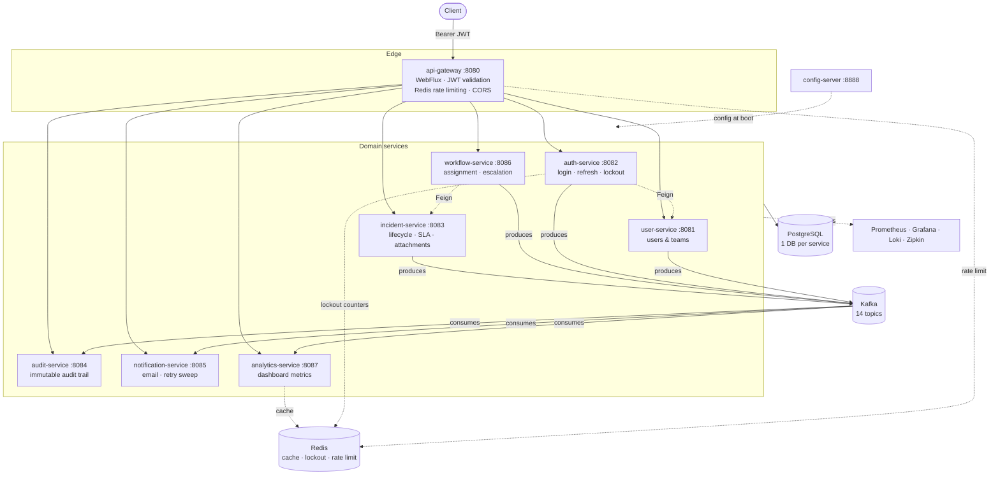

# SIRP — Security Incident Response Platform

A backend platform for managing security incidents inside an organization — think a lightweight **PagerDuty / Jira Service Management clone, purpose-built for security teams**. An incident is created, assigned, tracked through a lifecycle, escalated automatically on SLA breach, and every step is audited, emailed, and fed into a live metrics dashboard.

Built as **8 independently deployable Spring Boot microservices** plus a config server and API gateway — with the resilience, observability, and security patterns a real distributed system needs, not just the happy path.


---

## Why this project exists

Most portfolio CRUD apps stop at "it works." This one is built to answer the *next* question — what happens when a dependency goes down, a Kafka message gets redelivered, or a JVM env var relay silently mangles a 2048-bit key. Every non-obvious decision below was made deliberately, with a trade-off, and several real bugs found while wiring the system end-to-end are documented rather than hidden.

## Table of contents

- [Architecture](#architecture)
- [Tech stack](#tech-stack)
- [Service inventory](#service-inventory)
- [Key architectural decisions](#key-architectural-decisions)
- [Quick start](#quick-start)
- [API reference](#api-reference)
- [Security model](#security-model)
- [Resilience & observability](#resilience--observability)
- [Testing](#testing)
- [Deployment targets](#deployment-targets)
- [Known limitations](#known-limitations-left-in-on-purpose)
- [Project layout](#project-layout)

---

## Architecture



**Request flow, end to end:** the gateway validates the JWT and injects `X-User-*` convenience headers, applies a Redis-backed rate limit, then proxies to a domain service over a static route table. That service **re-validates the same JWT independently** — the gateway's headers are never trusted downstream, only used as a convenience — persists the change, and publishes a Kafka event. The event fans out to up to three independent consumers (audit, notification, analytics), none of which block the original HTTP response.

## Tech stack

| Layer | Choice |
|---|---|
| Language / runtime | Java 17, Spring Boot 3.5.16 |
| API Gateway | Spring Cloud Gateway (WebFlux/reactive) |
| Service framework | Spring Web (servlet), all 8 domain services |
| Persistence | PostgreSQL 17, one schema per service, Flyway migrations, Spring Data JPA |
| Async messaging | Apache Kafka 4.1 (Spring Kafka), 14 versioned topics |
| Caching / rate limiting / lockout | Redis 8 |
| Service discovery | Consul (registered everywhere, not used for routing — see below) |
| Config | Spring Cloud Config Server (native/filesystem backend) |
| Auth | JWT, RS256 asymmetric signing, Spring Security |
| Resilience | Resilience4j circuit breakers |
| Tracing | Micrometer Tracing + Brave → Zipkin |
| Logging | Logback → Loki (direct HTTP push) → Grafana |
| Metrics | Micrometer → Prometheus → Grafana |
| API docs | springdoc-openapi (Swagger UI) per service |
| Mapping | MapStruct |
| Build | Maven — **no parent/reactor POM**, every module builds independently |
| Containerization | Docker / docker-compose, plus plain Kubernetes manifests |
| Testing | JUnit 5, Mockito, AssertJ, standalone MockMvc — **258 tests** |

## Service inventory

| Service | Owns | Responsibility |
|---|---|---|
| `config-server` | — | Serves per-service YAML config at boot; every service fails fast without it |
| `api-gateway` | — | Single entry point; JWT validation, rate limiting, CORS, static routing |
| `auth-service` | `sirp_auth_db` | Login, refresh-token rotation, JWT minting (**only** holder of the private key), brute-force lockout |
| `user-service` | `sirp_user_db` | Users & teams, system of record, admin-only writes |
| `incident-service` | `sirp_incident_db` | Incident CRUD, lifecycle state machine, SLA calc, comments, file attachments |
| `workflow-service` | `workflow_db` | Assignment / escalation orchestration on top of incidents |
| `audit-service` | `sirp_audit_db` | Immutable audit trail, built entirely from Kafka events (read-only) |
| `notification-service` | `sirp_notification_db` | Multi-channel notifications driven by Kafka, with a failed-send retry sweep |
| `analytics-service` | `sirp_analytics_db` | Redis-cached dashboard read model, built from Kafka |
| `common-library` | — | Shared enums, Kafka event contracts, topic constants — no Spring Boot app |
| `sirp-security` | — | Shared JWT filter/validation as a Spring Boot **auto-configuration** module, used by every servlet service *and* the reactive gateway |

## Key architectural decisions

The part of a system design interview that actually matters — not just what was built, but why, and what it cost:

- **No parent/reactor Maven POM.** Every module is a fully independent `spring-boot-starter-parent` project — closer to how real polyrepo microservices are versioned and deployed, at the cost of no shared dependency-version enforcement.
- **RS256, not HS256, for JWTs.** Only `auth-service` ever holds the private signing key; every other service — including the gateway — only ever has the public key and can verify, never forge. Enforced in code: `JwtKeyProvider.getPrivateKey()` throws if called where the private key was never configured.
- **Gateway headers are a convenience, never a trust boundary.** `X-User-Id`/`X-User-Role`/etc. are injected for downstream convenience, but every domain service independently re-validates the signed JWT — defense in depth against a misconfigured network boundary, not just the gateway's word.
- **Kafka for state propagation, synchronous Feign only where an answer is needed *now*.** Incident lifecycle events fan out to 3 independent consumers with no coupling between them; a synchronous call is reserved for cases like "does this assignee exist and are they active," answered before an incident can be assigned.
- **Circuit breakers wrap a `Resilient*Client` component, never the raw Feign interface** — `@CircuitBreaker` is an AOP proxy annotation, and a self-invocation from one method to another *inside the same class* silently bypasses the proxy. Every consuming service always injects the wrapper.
- **One Postgres database per service, no cross-service joins.** The classic microservices ownership rule — what actually makes independent deployability real, at the cost of needing events or APIs instead of a `JOIN` for cross-service reads.
- **Correlation ID *is* the Micrometer trace ID**, not a second generated identifier — since distributed tracing was already fully wired, one ID serves as both the Zipkin trace key and the string you grep every service's logs for.
- **DLT naming is per-consumer, not per-topic** (`incident.created.v1.analytics-service.DLT`) — 4 incident topics are each consumed by 3 services; a shared DLT would interleave failures from all 3 with no way to tell whose processing actually failed.
- **`sirp-security` is a Spring Boot `@AutoConfiguration` module**, not component-scanned — a deliberate fix after an earlier component-scan approach caused bean-collision restarts across services. Every bean is `@ConditionalOnMissingBean`, so any consumer can still override a piece.

## Quick start

```bash
# 1. Copy the env template and fill in real secrets
cp .env.example .env

# 2. Generate a JWT keypair (Java 17 single-file launch, no compile step)
java scripts/GenerateJwtKeys.java
# paste the printed JWT_PUBLIC_KEY / JWT_PRIVATE_KEY into .env

# 3. Bring up the entire platform — infra + all 9 services, containerized
docker-compose up -d --build
```

That's it — Postgres auto-creates every per-service database on first boot (`postgres-init/init-databases.sql`), and every service waits on Config Server's health check before starting.

Then bootstrap the first admin user (no seed data exists on purpose — creating a user itself requires an ADMIN JWT):

```sql
INSERT INTO teams (id, team_name) VALUES (gen_random_uuid(), 'Bootstrap Team');
INSERT INTO users (id, username, email, password, enabled, role, team_id)
VALUES (gen_random_uuid(), 'admin', 'admin@sirp.local', '<bcrypt-hash>', true, 'ADMIN',
        (SELECT id FROM teams WHERE team_name = 'Bootstrap Team'));
```

| Endpoint | URL |
|---|---|
| API (all services, via gateway) | http://localhost:8080 |
| Swagger UI (per service) | http://localhost:8080/swagger-ui.html |
| Consul | http://localhost:8500 |
| Kafka UI | http://localhost:8090 |
| Grafana (anonymous admin) | http://localhost:3000 |
| Prometheus | http://localhost:9090 |
| Zipkin | http://localhost:9411 |

A ready-to-import **Postman collection + environment** live under [`postman/`](postman/). A **Kubernetes** manifest set (`k8s/`) also exists for a cluster deployment — see the [Deployment targets](#deployment-targets) section.

Prefer running services individually on the host? Each module has its own Maven wrapper — build the two shared libraries first (`common-library`, `sirp-security`), then `./mvnw spring-boot:run` per service directory. Full detail in [`CLAUDE.md`](CLAUDE.md).

## API reference

Full endpoint-by-endpoint reference (request/response shapes, pagination quirks, error formats) lives in [`CLAUDE.md`](CLAUDE.md#building-a-separate-frontend-against-this-api) — written for building a frontend against this API without reading the source. Highlights:

- **Auth**: `POST /api/v1/auth/login` → access + refresh tokens (RS256 JWT, 15 min / 7 day expiry). Refresh tokens rotate on every use. `423 Locked` after 5 failed attempts in 15 minutes.
- **Incidents**: strict linear lifecycle — `OPEN → ACKNOWLEDGED → IN_PROGRESS → RESOLVED → CLOSED`, out-of-order calls return `409`. Comments and file attachments (20MB max) are sub-resources.
- **Workflows**: assignment/escalation orchestration layered on top of incidents, with a scheduled SLA-escalation sweep every 5 minutes.
- **Audit / Analytics / Notifications**: fully read-only HTTP APIs — all written by Kafka consumers, not by direct writes.

## Security model

- **Login** → `AuthenticationManager` → `user-service` lookup via Feign → RS256 JWT minted with `sub`/`userId`/`role`/`iss`/`aud`/`jti` claims + an opaque, server-stored, rotate-on-use refresh token.
- **Brute-force protection**: Redis-backed, keyed by **email** (the gateway hides the real client IP), 5 failed attempts / 15 min → 15-minute lockout, `423`. The lockout check runs *before* Spring Security's `AuthenticationManager` is even invoked.
- **Rate limiting**: Redis token bucket at the gateway, 20 req/s sustained / burst 40, per client IP, uniform across every route.
- **Authorization is deliberately inconsistent** — a real, documented gap: only `user-service`'s admin writes and every service's `/actuator/**` are role-gated. `incident-service`/`workflow-service` have no `@PreAuthorize` at all; any authenticated user can assign or close any incident regardless of role. (Good interview material — see Known limitations.)

## Resilience & observability

- **Circuit breakers** (Resilience4j) around every Feign call: 10-call sliding window, 50% failure threshold, 10s open state. 4xx responses are excluded from the failure count but still reach the fallback method — a real bug (fallback swallowing 404/400 into a generic 503) was found and fixed here, and the same latent pattern is called out, unfixed, in a few other wrappers.
- **Distributed tracing**: 100% sampling to Zipkin, deliberately not production-tuned — the point of a dev environment is never missing the one request you're debugging. Feign and Kafka spans required explicit opt-in (`feign-micrometer`, `spring.kafka.*.observation-enabled`) — neither is automatic in Spring Boot, and both were silently broken (a Kafka-consumed span starting a disconnected new trace) until fixed.
- **Dead-lettering**: 1 initial attempt + 3 retries (1s→2s→4s backoff), then a per-consumer DLT (`<topic>.<service>.DLT`) — not Spring Kafka's shared default, since 3 different services consume the same incident topics.
- **Centralized logging**: direct Loki push from Logback (no Promtail), correlation ID = the trace ID, searchable across every service in one Grafana query.
- **Prometheus + Grafana**: every service exposes `/actuator/prometheus` publicly (unlike the rest of `/actuator/**`, which is ADMIN-gated) — a static scrape target can't hold a 15-minute-lived JWT.

## Testing

**258 tests**, added from a standing start of zero real coverage (only Spring Boot's default context-load smoke test existed originally), across the 6 domain services with actual business logic:

- **Service layer**: pure Mockito, no Spring context — fast and isolated.
- **Controllers**: `MockMvcBuilders.standaloneSetup(...)` rather than `@WebMvcTest`, to avoid dragging in JWT auto-configuration that fails fast without a real RSA key — while still exercising `@Valid` validation and the real `GlobalExceptionHandler`.
- **Real cryptography where it matters**: JWT-issuing tests generate an actual RSA keypair and round-trip sign/verify with the real `jjwt` library rather than mocking away the thing under test.
- Writing the tests **found real bugs**, not just verified existing behavior — e.g. `IncidentStatusValidator`'s `switch` statement silently no-ops on `ON_HOLD` instead of throwing, because a Java `switch` *statement* (unlike a `switch` *expression*) doesn't require enum exhaustiveness.

## Deployment targets

Three interchangeable ways to run this, chosen by which env vars resolve — nothing in the app code needs to know which mode it's in:

| Mode | How | Notes |
|---|---|---|
| Host-run | `./mvnw spring-boot:run` per module, infra via `docker-compose up -d <infra-services>` | Original mode; inter-service URLs default to `localhost:<port>` |
| Full docker-compose | `docker-compose up -d --build` | Every service (app + infra) as a container; Postgres auto-creates its own databases |
| Kubernetes | manifests under [`k8s/`](k8s/) | `ConfigMap`/`Secret` (sourced from the same `.env`), per-service `Deployment` + `Service` + probes, `initContainers` gating on Config Server/Postgres health, PVCs for Postgres data and incident attachments |

## Known limitations (left in on purpose)

Being able to talk about real, unfixed gaps is a stronger signal than pretending the system is flawless:

- **Authorization is inconsistent by design** — `incident-service`/`workflow-service` have no role checks beyond "authenticated"; only `user-service` is admin-gated.
- **`X-Team-Id` is always empty** — the JWT-issuing side of the `teamId` claim was never finished, even though the reading side is fully wired.
- **Two pagination envelope shapes** exist across services (`{content,page,size,...}` vs. raw Spring Data `Page<T>`) — never unified.
- **No poison-pill handling** for Kafka — a message that fails to *deserialize* isn't retried or dead-lettered by the current error-handler setup.
- **Single-instance local disk storage** for incident attachments — would need shared storage (S3, etc.) for a multi-instance deployment.
- **Every secret is plaintext** in YAML/env vars — fine for local dev, would need a real secrets manager (Vault, AWS Secrets Manager) in production.
- **Port drift** between `auth-service`'s own defaults (8081) and what Config Server actually serves it (8082) — never reconciled; Config Server's value wins once fetched.
- **Gateway routing is a static table**, not Consul `lb://` — deliberate, for testability without Consul running, with an acknowledged TODO to switch.

## Project layout

```
SIRP/
├── api-gateway/            # Reactive gateway (WebFlux) — JWT edge validation, rate limiting, CORS
├── auth-service/            # Login, refresh tokens, JWT minting
├── user-service/            # Users & teams (system of record)
├── incident-service/        # Incident lifecycle, comments, attachments, SLA
├── workflow-service/        # Assignment/escalation orchestration
├── audit-service/           # Immutable audit trail (Kafka-consumer-built)
├── notification-service/    # Email notifications + retry sweep
├── analytics-service/       # Dashboard metrics (Redis-cached, Kafka-built)
├── config-server/           # Spring Cloud Config Server
├── common-library/          # Shared DTOs, enums, Kafka event contracts
├── sirp-security/           # Shared JWT auto-configuration (servlet + reactive)
├── k8s/                     # Kubernetes manifests
├── postman/                 # Postman collection + environment
├── prometheus/, grafana/, loki/   # Observability stack config
├── scripts/GenerateJwtKeys.java  # RSA keypair generator for JWT_PUBLIC_KEY/JWT_PRIVATE_KEY
└── docker-compose.yml       # Full local stack — infra + every service
```

Every domain service follows the same internal layering: `controller → service/service.impl → repository`, with MapStruct `mapper`s, JPA `Specification`s for dynamic filtering, and a service-local `GlobalExceptionHandler`.

For the full technical deep-dive (config quirks, every Kafka topic, every known gap, endpoint-by-endpoint request/response shapes) see [`CLAUDE.md`](CLAUDE.md).

---

*Personal/portfolio project — built with production-grade patterns (circuit breakers, distributed tracing, dead-letter queues, asymmetric JWT signing, idempotent Kafka consumers) on a scale meant for one developer to reason about end to end, not a production SaaS.*
